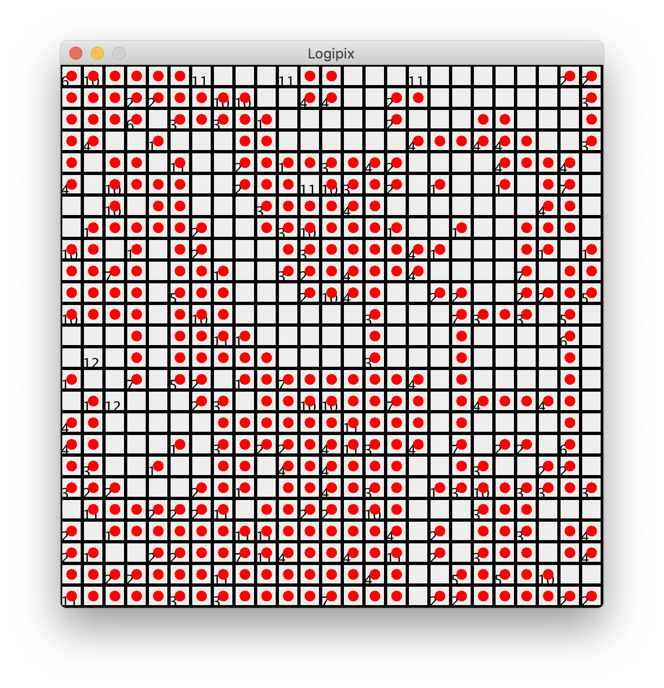

# Logipix

## Logipix rules

https://www.conceptispuzzles.com/index.aspx?uri=puzzle/link-a-pix/rules

## Logipix implementation

To solve a Logipix problem, you can execute the main method of the “Test” class.


```js
javac Test.java
java Test
```
 The logipix grid to be solved is choosen in the *Examples* folder:

 ```python
 #Test.Java
 Logipix m = new Logipix("Examples/Man.txt");
 ```

## Console Display : 



The program returns "true" if the puzzle has a solution (otherwise "false") and displays this solution in another window. It also displays in the console the time required to calculate the solution.

To speed up the representation of the solution, pass the "slow" method in the "solve()" function of the Logipix class as a comment.
